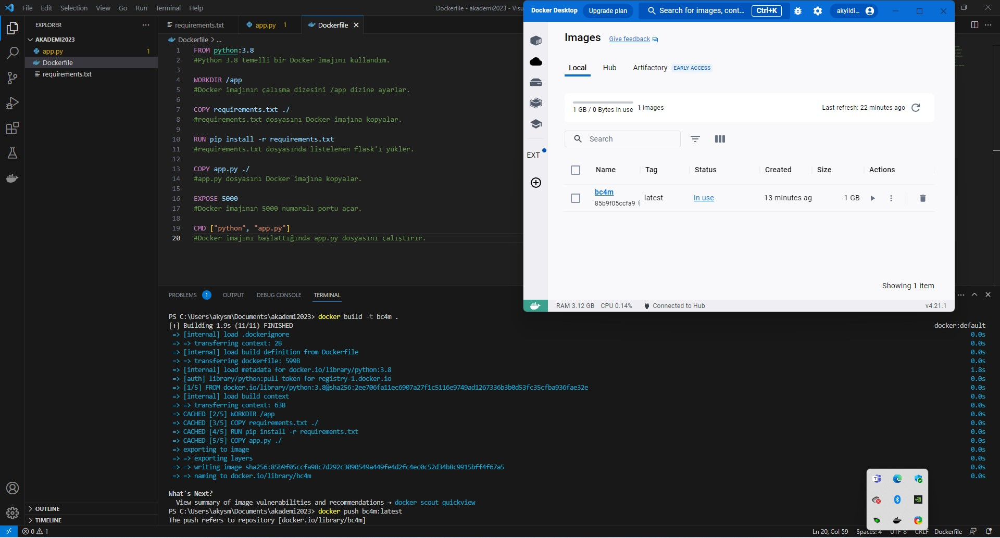
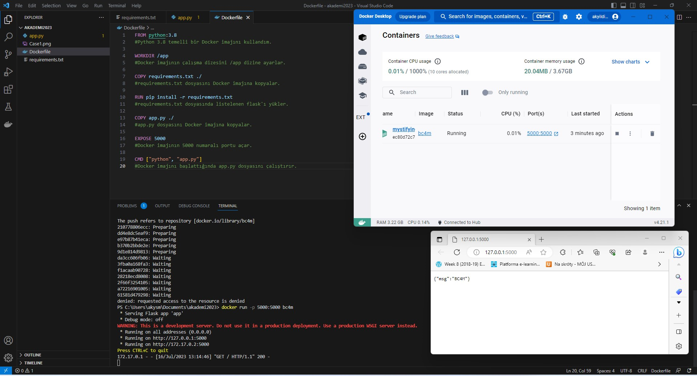

### Docker Nedir ? 
Docker, uygulamalarınızın çalışma ortamını bir konteyner içinde izole etmenizi sağlayan bir platformdur. Bu, uygulamalarınızın her yerde aynı şekilde çalışmasını sağlar ve dağıtım sürecini kolaylaştırır.

***Docker;*** 

- Uygulamaların dağıtımını kolaylaştırmak
- Uygulamaların test edilmesini kolaylaştırmak
- Uygulamaların performansını iyileştirmek
- Uygulamaların güvenliğini artırmak
- Uygulamaların ölçeklenmesini kolaylaştırmak 

    amacıyla kullanılır.

### Docker Komutları

***Docker komutları***, Docker platformu ile etkileşim kurmak için kullanılır.<br>En yaygın Docker komutları şunlardır:


|KOMUT| AÇIKLAMA|
| :--- | :---: |
|`docker build`|  Bir Docker imajını oluşturur.|
|`docker run`| Bir Docker imajını çalıştırır.|
|`docker stop`| Bir Docker konteynerini durdurur.|
|`docker start`|Bir Docker konteynerini başlatır.|
|`docker remove`| Bir Docker konteynerini siler.|
|`docker images`| Docker imajlarını listeler.|
|`docker ps`| Çalışan Docker konteynerlerini listeler.|


### Dockerfile
Dockerfile, bir Docker imajını oluşturmak için kullanılan bir metin dosyasıdır. Dockerfile, bir imajdaki katmanları tanımlar. Katmanlar, bir imajdaki dosyaların ve ayarların gruplarıdır. Dockerfile, bir imajdaki katmanları oluşturmak için komutlar içerir.

***Dockerfile***'da kullanılabilen bazı yaygın komutlar şunlardır:
|KOMUT| AÇIKLAMA|
| :--- | :---: |
|`FROM`|  Bir temel imaj belirtir.|
|`RUN` |Bir komut çalıştırır.|
|`COPY`| Bir dosyayı veya dizini kopyalar.|
|`ADD` |Bir dosyayı veya dizini indirir ve açar.|
|`EXPOSE`| Bir bağlantı noktasını açar.|
|`CMD`| Bir konteyneri başlatmak için komutu belirtir.|

***Docker*** , uygulamalarınızın dağıtımını, test edilmesini, performansını, güvenliğini ve ölçeklendirmesini kolaylaştıran güçlü bir platformdur.

----------------------------------------------------
----------------------------------------------------

Aşağıdaki **Dockerfile** , bir Python web uygulamasını çalıştırmak için bir Docker imajını oluşturmak için kullanılır:
```
FROM python:3.8

WORKDIR /app

COPY requirements.txt ./

RUN pip install -r requirements.txt

COPY app.py ./

EXPOSE 5000

CMD ["python", "app.py"]
```

1. Bu Dockerfile, Python 3.8 imajını temel alır. 
2. requirements.txt dosyasını /app dizinine kopyalar. 
3. pip komutunu kullanarak requirements.txt dosyasında listelenen modülleri yükler. 
4. app.py dosyasını /app dizinine kopyalar.
5. Son olarak app.py dosyasını çalıştırmak için CMD komutunu kullanır.

---------------------------------




Dockerfile'ı kullanarak bir Docker imajını oluşturmak için `docker build -t bc4m . ` komutunu kullanabilirsiniz.<br> 
`docker push bc4m:latest` kodu, `bc4m:latest` etiketini taşıyan Docker imajını Docker Hub'a yükler.<br> `bc4m` etiketi, imajınızı tanımlar.<br> `latest` etiketi, imajınızın en son sürümünü belirtir.  


 



`docker run -p 5000:5000 bc4m`
Bu komut, `bc4m` Docker imajını çalıştırır ve imajdaki `5000` numaralı bağlantı noktasını yerel bilgisayarınızdaki `5000` numaralı bağlantı noktasına eşler. Bu, web tarayıcınızda `http://localhost:5000/` adresini ziyaret ederek Docker imajından çalışan web uygulamasını görüntüleyebileceğiniz anlamına gelir.

`-p` seçeneği, Docker imajının bağlantı noktalarını yerel bilgisayarınızdaki bağlantı noktalarına eşlemenizi sağlar. Bu durumda, `bc4m` imajının `5000` numaralı bağlantı noktası `localhost` üzerinde `5000` numaralı bağlantı noktasıyla eşlenir. Ardından, web tarayıcınızda `http://localhost:5000/` adresini ziyaret ederek Docker imajından çalışan web uygulamasını görüntüleyebilirsiniz.

`bc4m` imaj, "BC4M" mesajını döndüren basit bir Flask uygulamasıdır. `docker run` komutunu çalıştırdığınızda, Flask uygulaması başlar ve `5000` numaralı bağlantı noktasında istekleri dinler. Web tarayıcınızda `http://localhost:5000/` adresini ziyaret ettiğinizde, Flask uygulaması "BC4M" mesajını döndürür.

Çıktıda gösterilen diğer satırlar, Flask uygulamasının ayrıntılarını gösterir, örneğin dinlediği bağlantı noktası ve erişilebildiği IP adresleri. 

Satırlarda çalıştığı gösterilen bağlantılara ctrl + sol tuş ile tıkladığınızda browser üzerinde mesajınızı doğru bir şekilde görüntüleyebilirsiniz. 


----------------------------------------------------------
Yukarıdaki işlemleri gerçekleştirebilmek öncelikle aşağıdaki adımları uygulamalısınız.

- Sisteminizin güncel olduğundan emin olun.
- Başlat sekmesinden "Windows özelliklerini aç veya kapat (Turn Windows features on or off) paneline girin.
- Sanal makine platformu (Virtual Machine Platform) özelliğinin açık (sol tarafında tik işareti olmalı.) olduğundan emin olun.
- Windows Subsytem for Linux uygulamasını indirin. Microsoft Store kullanabilirsiniz.
- Docker Desktop kurulumunu gerçekleştirin.
- Dilerseniz çalışıp çalışmadığını örneklerle deneyin

    -  Ben Visual Studio Code kullandım. Dilerseniz kurulumunu gerçekleştirip üstteki komutları deneyebilirsiniz. Visual Studio Code Extension'larından Docker ve Python'ı ekledim.

-------------------------------------------------------


